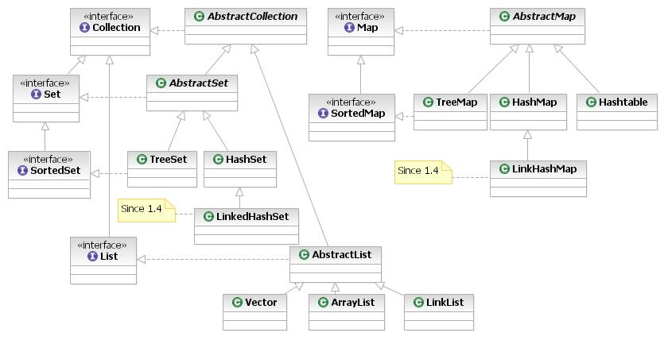

*****************
泛型與 Collection
*****************

泛型（generics）是一種可以讓變數或方法的型態，\
經由「型態參數」的使用，讓這些變數或方法的型態，\
可以更廣泛而又有彈性的型態宣告機制。\
泛型可以強化編譯時間的型態檢查（compile-time type checking），\
也可以讓程式碼更有彈性與再利用性。

舉例而言，如果我們需要用陣列來寫一個儲存實例的類別 ``Store``\ ，\
而 ``Store`` 有 ``put``\ 、\ ``elementAt`` 及 ``printAll`` 三個實例方法。\
那麼這個類別可以這麼寫：

.. code-block:: java

	public class Store {
	  Object[] myStore;
	  int here = 0;   // 追蹤目前的儲存位置
	  Store (int n) {
	    myStore = new Object[n];   // 能儲存 n 個實例
	  }
	  void put(Obejct in) {
	    if (here &lt; myStore.length - 1) {
	      myStore[here] = in;
	      here++; 
	    } else {
	      // 錯誤：超過容量
	    }
	  }
	  Object elementAt(int i) {
	    if ((0 &lt;= i) && (i &lt; myStore.length)) {
	      return myStore[i];
	    } else
	      // 錯誤：超出範圍
	    }
	  }
	  void printAll() {
	    // 印出所有的儲存在 myStore 中的物件
	  }
	}

為了讓 ``Store`` 能夠存放不同類型的實例，\
``myStore`` 必須宣告成 ``Object``\ ，\
因為所有實例的型態也都是 ``Object``\ 。\
這樣的寫法可以讓一個 ``Store``\ ，\
能夠存放不同類別的實例。\
例如：

.. code-block:: java

	Store s = new Store(10);
	s.put(new Integer(2));
	s.put("a String");

然而，從 s 取出實例時便需要轉型，\
以回復原來的型態：

.. code-block:: java

	Integer integer = (Integer) s.elementAt(0);
	String string   = (String) s.elementAt(1);

當我們需要呼叫儲存在 s 內的實例方法時，\
也需要轉型。\
這樣便相當的不方便。\
例如：

.. code-block:: java

	Store s = new Store(10);
	s.put(new Integer(2));
	s.put("a String");
	for (int counter = 0; counter &lt; 2; counter++) {
	  // 如果要呼叫 s.elementAt(counter) 的某個方法，便一定要轉型
	  // 因為 s.elementAt(counter) 的型態是 Object
	  if (s.elementAt(counter) instanceOf String) { 
	    // instanceof 這個保留字可以用來測試某個實例是否是某個型態
	    // ... (String)s.elementAt(counter).length() ...
	  } else if (s.elementAt(counter) instanceOf Integer) {
	    // ... (Integer)s.elementAt(conter).toString() ...
	  }
	}

然而，在 Java SE 5 以後，程式設計師可以使用泛型以解決上述的問題。例如：

.. code-block:: java

	// 使用 ArrayList&lt;T> 這個 generic class 來產生一個專門存放 
	// Exam 的 ArrayList：new ArrayList&lt;Exam>()。T 是一個型態參數，
	// 實際使用時可以被其他的 reference type 代替，例如：Exam。
	// 如果不能夠宣告存放在一個ArrayList中的物件是Exam型態的物件，
	// 那麼解決的方式就是存放Object型態的物件，但是這樣在取用時，
	// 便相當的不方便，而泛型的使用解決了這個問題。
	
	List&lt;Exam> e = new ArrayList&lt;Exam>();
	
	// 使用 e.add(...) 存入實例
	
	e.add(new EnglishExam(9, 8, 7));
	e.add(new ChineseExam(8, 9, 6));
	
	// 使用 e.get(i) 傳回存放在位置 i 的實例
	
	Exam anExamInstance = e.get(0);
	
	// 存入更多的實例...
	
	// 這種 for-loop 每 loop 一次便傳回一個 e 中的實例
	// 被傳回的實例存放在 anExam 這個變數內
	for (Exam anExam : e) { 
	  // anExam的型態是Exam，因此不需要轉型
	  System.out.println(anExam.score());
	}

至於為何要使用 new Integer(...)，來製造一個 integer 的實例呢？\
其原因是：Java 的程式庫中有許多類別，為了簡化這些類別的撰寫，\
讓它們不用考慮 primitive type 與 reference type 的差異：\
例如，上例的 Store 便可以讓所有的 reference type（所有的 Object），\
都能存放，但卻不能存放 primitive type 的值。\
因此，Java 使用 **boxing** 的方式將 primitive 轉型為 reference 型態，\
例如：Integer(3) 就是將 primitive type 的 3 boxing 成 reference type 的 Integer(3) 。\
**Unboxing** 則可以將之還原成 primitive 型態。\
自從 Java 5.0 版之後，boxing 及 unboxing 都是自動的。\
然而，程式設計師也可以撰寫執行 boxing 及 unboxing 的程式碼，\
例如：Integer(i) 可以將 int i 轉型成 Integer，\
而 (int)o 則可以將型態為 Integer 的 o 轉型成 int。

Collection 與 Map
==================

為了讓程式設計師能夠不必自行設計 Store 這種用來儲存實例的資料結構。\
Java 在 java.util 這個套件中，\
提供了 Collection 與 Map 的 API (Application Programming Interface) 供程式設計師使用。

一個經由 ``generic interface Collection<T>`` 所產生的 collection，\
可以用來儲存與處理許多型態是 T 的實例。\
Collection<T> 的架構有三個主要的層次：\
第一層包括：Collection<T>, List<T>, Set<T>, SortedSet<T> 幾個 interfaces；\
第二層包括：\
AbstractCollection<T>, AbstractList<T>, AbstractSequentialList<T>, AbstractSet<T>
幾個 abstract classes，\
第三層包括：\
ArrayList<T>, LinkedList<T>, HashSet<T>, LinkedHashSet<T>, TreeSet<T> 幾個類別。\
這份講義將以 ArrayList<T> 當作例子，\
說明 Collection API 的使用方式。

一個經由 ``generic interface Map<K, V>`` 所產生的 map，
能夠對應由型態是 K 的 keys 與型態是 V 的 values，
而一個 key 最多只能對應一個 value。Map<K, V>的架構也有三個層次：
第一層包括：Map<K, V> 及 SortedMap<K, V> 兩個 interface；
第二層包括：AbstractedMap<K, V> 這個 abstracted class；
第三層則包括：IdentityHashMap<K, V>, HashMap<K, V>, LinkedHashMap<K, V> 及 TreeMap<K, V>幾個類別。
這份講義將以 HashMap<K, V> 當作例子，
說明 Map API 的使用方式。

Generic List
============

List<T> 是 Java 的類別館 java.util package 所提供的一個 interface。
實作 List<T> 的類別能夠將所存放的元素以當初存入的次序依序取出。
ArrayList<T> 是一個實作 List<T> 的類別；
LinkedList<T> 是另一個實作 List<T> 的類別。
以下是使用 ArrayList<T> 的範例（T 是型態參數，使用時能夠以真實的型態代替之）：

.. code-block:: java

	import java.util.List;
	...
	
	// 宣告 list 是一個可以儲存 String 的 ArrayList
	
	List<String> list = new ArrayList<String>();  
	
	// 用 list.add(...) 存入實例
	
	String string1 = "a string";
	list.add(string1);
	...
	
	// 用 list.get(...) 取出實例
	String string2 = list.get(0);
	
	// 用 list.iterator() 及 while-loop 依存入的次序，取出及處理每一個實例
	
	Iterator<String> iterator = list.iterator();
	
	while (iterator.hasNext()){
	  String aString = iterator.next();
	  ...
	}
	
	// 用 for-loop 依存入的次序，取出及處理每一個實例
	
	for (String aString : list) {
	  System.out.println(aString);
	  ...
	}

Generic Map
===========

Map<K, V> 是 Java 的類別館 java.util package 所提供的一個 interface。
實作 Map<K, V> 的類別，能夠將 key 與 value 一對一對的存入，
而一個 key 只能與一個 value 對應。HashMap<K, V> 是一個實作 Map<K, V> 的類別。
以下是使用 HaspMap<K, V> 的範例（K, V 是型態參數，使用時能夠以真實的型態代替之）：

.. code-block:: java

	import java.util.Map;
	
	// ...
	// map 是一個對應 Integer 與 String 的 HashMap
	
	Map<Integer, String> map = new HashMap<Integer, String>();
	
	// 用 map.put(..., ...) 存入一對 key 與 value
	
	Integer key1   = new Integer(123);
	String  value1 = "value abc";
	map.put(key1, value1);
	// ...
	
	// 用 map.get(key1) 取出與 key1 對應的 value
	
	String value1_1 = map.get(key1);
	
	// 或者直接存入 123 而不是 Integer(123)
	// 而 auto-boxing 會將 123 轉換成 Integer(123)
	
	Integer key1   = 123;
	String  value1 = "value abc";
	map.put(key1, value1);
	
	// 使用 map.get(key, value) 存入，接著以 map.get(key) 取出 value 
	
	map.put(123, value1);
	String value1_1 = map.get(123);
	
	// 用 map.keySet().iterator() 及 while-loop 取出每一個 key
	// 接著用 map.get(...) 取出每一個 value 
	Iterator<Integer> keyIterator   = map.keySet().iterator();
	while (keyIterator.hasNext()){
	  Integer aKey   = iterator.next();
	  String  aValue = map.get(aKey);
	}
	
	// 用 map.values().iterator 及 while-loop 取出每一個 value
	Iterator<String>  valueIterator = map.values().iterator();
	while (valueIterator.hasNext()){
	  String aString = valueIterator.next();
	}
	
	// 用 for-loop 取出每一個 key 與 value
	for (Integer aKey : map.keySet()) {
	  String aValue = map.get(aKey);
	  System.out.println("" + aKey + ":" + aValue);
	}
	
	// 用 for-loop 列印每一個 value
	for (String aValue : map.values()) {
	  System.out.println(aValue);
	}

Generic的應用實例
=================

堆疊（stack）是一種「後進先出」（last in first out）的資料結構。
可以將一個堆疊想像成是一個能裝盤子的桶狀物，
盤子一個一個的堆上去；
取出時則先取出最後放入，也是最上面的盤子。
堆疊有兩個常用的方法：push 將一筆資料放入堆疊，pop 將最後放入的資料取出。

以下這個範例應用 LinkedList<T> 實作一個 UnboundedStack 類別，
UnboundedStack 沒有設定能儲存的資料量有多少。
UnboundedStack 繼承 Stack 這個抽象類別。
除了 push 與 pop 兩個抽象方法之外，
Stack 還有一個 top 方法，
這個方法只是將 stack 上方的值傳回，
而不實際取出；
因此可以將最上方的值先 pop 出來，
得到其值後，再 push 回去，
以保持 stack 原來的狀態。

UnboundedStack 使用 LinkedList<T> 的 addFirst 及 removeFirst 兩個方法。
addFirst 將一個實例加入一個 list 的最前方；
removeFirst 將一個 list 最前方的實例取出。 

UnboundedStack 的限制是：
只能將 String 類別的實例，放入堆疊中。
此外，當一個堆疊中沒有資料時，pop 傳回 null。
null 是一個保留字，其意義是「沒有實例」。
null 也是 reference type 變數的初始值（default value）：

.. code-block:: java

	import java.util.*;
	
	abstract class Stack {
	  abstract String pop();
	  abstract void push(String value);
	  
	  String top(){
	    String value;
	
	    value=this.pop();
	    this.push(value);
	    return value;
	  }
	}
	class UnboundedStack extends Stack{
	  LinkedList<String> stack = new LinkedList<String>();
	  
	  boolean empty(){
	    return (stack.size() == 0) ? true : false;
	  }
	  void push(String arg){
	    stack.addFirst(arg);
	  }
	  String pop(){
	    if (!(this.empty())) {
	      String topValue = stack.getFirst();
	       stack.removeFirst();
	       return topValue;
	    } else {
	       return null;
	    }
	  }
	}
	
	public class UStackMain {
	  public static void main(String args[]) {
	    UnboundedStack s = new UnboundedStack();
	    s.push("abc");
	    s.push("def");
	    s.push("ghi");
	    System.out.println(s.top());  // 印出 ghi
	    System.out.println(s.pop());  // 印出 ghi
	    System.out.println(s.pop());  // 印出 def
	    System.out.println(s.pop());  // 印出 abc
	    System.out.println(s.pop());  // 印出 null
	  }
	}

以下這個範例，更進一步的應用泛型，
使得一個堆疊能夠存放不同型態的實例：

.. code-block:: java

	import java.util.*;
	abstract class Stack<T> {
	  abstract T pop();
	  abstract void push(T value);
	  T top() {
	    T value;
	    value=this.pop();
	    this.push(value);
	    return value;
	  }
	}
		
	class UnboundedStack<T> extends Stack<T> {
	  LinkedList stack = new LinkedList<T>();
	  
	  boolean empty() {
	    return (stack.size() == 0) ? true : false;
	  }
	  void push(T value) {  
	    stack.addFirst(value);
	  }    
	  T pop() { 
	    if (!(this.empty())) {
	      T topValue = (T)stack.getFirst();
	      stack.removeFirst();
	      return topValue;
	    } else {
	      return null;
	    }
	  }
	}
	
	public class GUStack {
	  public static void main(String args[]) {
	    UnboundedStack s = new UnboundedStack();
	    s.push("abc");    s.push(2);    s.push("ghi");
	    System.out.println(s.top()); // 印出 ghi
	    System.out.println(s.pop()); // 印出 ghi
	    System.out.println(s.pop()); // 印出 2
	    System.out.println(s.pop()); // 印出 abc
	    System.out.println(s.pop()); // 印出 null
	  }
	}
