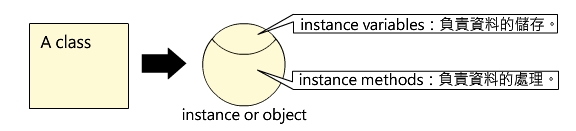
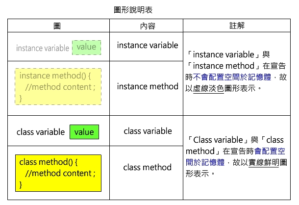

************************
實例、實例變數與實例方法
************************

Java 是一個物件導向程式語言。\
物件導向的基本觀念是讓程式可以描述、\
建構及處理真實世界中所看到的物件並設計它們之間的層次關係。\
例如：\ ``Exam`` 可以有 ``EnglishExam``\ 、\ ``ChineseExam`` 兩個副屬的種類。\
而一次 ``EnglishExam`` 又可以有任意數量的考生應考，\
其中每一份考卷中都可以有考生姓名與成績的資料。\
這時 ``Exam``\ 、\ ``EnglishExam`` 及 ``ChineseExam`` 便很適合設計成類別，\
而一份英文考試的考卷便可以用 ``EnglishExam``\
這個類別所生成的實例（instance or object）來代表。

一個類別可以使用 ``new`` 指令來產生實例。\
一個 Java 的程式可以由許多個有層次關係的類別構成，\
這個層次關係描述這些類別間的\ **繼承關係**\ 。\
這一類的例子在真實世界中不勝枚舉，\
舉例來說：如果「哺乳類」是一個類別，\
那麼「人類」則可以是「哺乳類」的一個「\ **子類別**\ 」（subclass or subtype），\
相對的「哺乳類」也可以是「人類」的「\ **父類別**\ 」（superclass or supertype）。\
而某一個人「張三」便是「人類」的一個「\ **實例**\ 」。

以「張三」這個實例來說，\
他的身高、體重、性別等資料都可以存放在這個實例的「實例變數」中，\
而「張三」能「跑」能「跳」，則可以是它的「實例方法」。\
簡單的說：「類別（class）」可以用 new 來產生「實例（instance）」，\
而「實例」可以包含「實例變數」與「實例方法」。\
其中「實例變數」負責資料的儲存，而「實例方法」則負責資料的處理：

.. topic:: 備註

    Java 原文將「實例變數」稱為 non-static field；\
    而將「實例方法」稱為 non-static method。\
    為了中文的譯名一致，\
    本書將以 instance variable 與 instance method 稱之。\
    同樣的，本書亦將以 class method 代替原文的 static method，\
    以 class variable 代替原文的 static variable。

何謂實例（Instance）
===================

實例（instance）是由 ``new`` 所產生的某個類別的實作，\
也稱為物件（object）。\
一個 class 可以生成多個實例，\
而且每個實例都擁有一份自己的實例變數。\
以下圖為例：class A 宣告了三個實例變數 x，y 與 z，\
而每個實例都為這三個實例變數配置了記憶體以儲存他們的值。

.. image:: images/newImage005.jpg

「實例變數」及「實例方法」與用於設計結構化程式的「類別變數」及「類別方法」的主要差異是：

1. 類別變數或類別方法以 static 起始，他們在程式開始執行時即實質的存在，所以不需要產生實例，即可使用。
2. 實例變數或實例方法沒有 static 起始，他們一定要等到實例產生之後才有實質的存在，因此需要實例，才可以使用。

在後續的圖例中，我們將使用「淡的顏色」來表示「沒有記憶體、沒有實質存在的變數或方法」，並以「鮮明的顏色」來表示「有記憶體、有實質存在的變數或方法」以區別它們的差異：

以下是一個藉由呼叫實例方法將實例變數的值傳回並輸出的範例：

.. literalinclude:: src/main/java/PrintBookName.java
   :language: java

.. topic:: 執行結果

    ::

    	Name of b1:Sun
    	Name of b2:Sun

`觀看執行過程及詳細解說 <https://github.com/plweb/JavaSteps/raw/master/images/Ex2.swf>`_

Class Method 與 Instance Method 的差異
======================================

接下來的這個範例，說明了類別方法與實例方法的差異：

.. literalinclude:: src/main/java/ClassInstanceMethod.java
   :language: java

.. topic:: 執行結果

    ::
    
    	=呼叫類別方法=
    	class method不需new就可使用
    	=呼叫實例方法=
    	instance method需new才可使用

`觀看執行過程及詳細解說 <https://github.com/plweb/JavaSteps/raw/master/images/Ex3.swf>`_

Class Variable 與 Instance Variable 的差異
==========================================

這個範例繼續說明了類別變數與實例變數之間的差異:

.. literalinclude:: src/main/java/ClassInstanceVariable.java
   :language: java

.. topic:: 執行結果

    ::
    
	    a of obj1:2
        a of obj2:2
        b of obj1:20
        b of obj2:30

`觀看執行過程及詳細解說 <https://github.com/plweb/JavaSteps/raw/master/images/Ex4.swf>`_

由於 a 是類別變數，只有一個儲存值，而這個值是共享的；\
b 則是實例變數，所以每個實例都有一個 b 的儲存值，而它們的值也可以不一樣。

類別變數、區域變數與實例變數的不同之處，\
透過它們在 Java 程式內的\ **可見範圍**\ （scope）與佔用記憶體的\
**起始時間與釋放時間**\ （extent）的不同，可以更明確的區分出來：

1. **類別變數**\ ：
   
   每一個 class 都有一個命名空間（name space），\
   因此兩個 class 若有同名的變數、方法也不用擔心彼此衝突。\
   這便好像將一個程式的記憶體劃分成好幾個區域，\
   而每一個 class 都配屬了一個區域。\
   隸屬於某一 class 的類別變數的有效時間是從程式開始執行，\
   一直到程式結束：

    * extent：從程式開始執行，一直到程式結束；
    * scope：以 ``public``\ 、\ ``private``\ 、\ ``protect`` 宣告類別變數的可見範圍。

2. **區域變數**\ ：
   
   於方法執行時才存在，方法執行完畢後便消失。\
   這種變數的值是存放在記憶體中稱為堆疊（stack）的一塊區域上。

    * extent：從方法執行時開始，到方法結束時為止。
    * scope：該變數所屬，由 { } 區隔的區塊（block）中。

3. **實例變數**\ ：
   
   實例變數是用來的儲存實例中資料的變數，\
   實例（instance）的另一個名稱是物件（object）。\
   例如在一個處理學生資料的程式中，某一學生的資料，\
   可以存放在 ``name``\ 、\ ``id``\ 、\ ``score``\
   等幾個隸屬於這個物件的實例變數中。\
   實例是存放在記憶體中稱為堆積堆（heap）的一塊區域上。

    * extent：從一個實例被造（new），直到它的記憶體被回收（garbage collect）時為止。
    * scope：以 public、private、protect 宣告實例變數的可見範圍。

實例方法中的 this 是什麼？
==========================

這個單元將會以數個範例，將一個類別方法，轉換成作用相同的實例方法，
以更深入的闡述在實例方法中常常用到的this這個保留字的意義。

在下面的範例中 ``ee`` 是一個用 ``new``
生成的 ``EnglishExam`` 物件，\
這個物件的三個實例變數分別被設值成 3, 4, 5，\
然後傳入 ``englishScore`` 這個類別方法中：

.. literalinclude:: src/main/java/EnglishExamDemo.java
   :language: java

.. topic:: 執行結果

    ::

	    The score of the exam is 12

``englishScore`` 雖然是一個類別方方法，\
然而傳入這個方法的三個參數，\
實際上是 ``ee`` 的三個實例變數的值。\
那何必這麼麻煩？直接將 ``ee`` 傳入 ``englishScore`` 不是更簡潔嗎？

以下即是將上例改寫後的版本：

.. literalinclude:: src/main/java/EnglishExamDemo2.java
   :language: java

這個範例直接將 ``ee`` 傳入 ``score``\ （原名是 ``englishScoer``\ ）中，\
而 ``score`` 仍然是一個類別方法。在這個例子中我們使用：

.. code-block:: java

	EnglishExam.score(ee);

來呼叫score這個方法。如果我們將以上的呼叫改寫成：

.. code-block:: java

    ee.score();

並將 score 這個類別方法，改寫成實例方法:

.. literalinclude:: src/main/java/EnglishExamDemo3.java
   :language: java

那麼執行的結果仍然是：

.. topic:: 執行結果

    ::

	    The score of the exam is 12

由此可見，一個 instance method 其實有一個隱藏的參數。
以上例而言是 ``ee``\ ，\
而任何在 ``score`` 方法中所用到的變數，
如果不是區域變數或是類別變數，便會被當成是該隱藏性參數（\ ``ee``\ ）的實例變數。

如果我們需要支援 ``ChineseExam``\ ，\
那麼上面的程式可以進一步改寫如下：

.. literalinclude:: src/main/java/MoreExamDemo.java
   :language: java

前面所提到的隱藏參數，可以使用 ``this`` 這個保留字來抓到。因此，上例也可以改寫成：

.. literalinclude:: src/main/java/MoreExamDemo2.java
   :language: java

``this`` 的值是當使用一個實例呼叫一個實例方法\
（例如：\ ``ee.score()``\ ）時所傳入的隱藏性參數，\
而這個隱藏性參數便是那個實例（即：\ ``ee``\ ）的地址。\
因此，如果你在一個實例方法內更改一個實例變數的值時，\
那個實例變數的值便永遠被更改。

Java 可以使用 ``this`` 也可以不使用 ``this`` 來存取實例的變數或方法。\
在後續的單元，我們為了說明的需要，\
有時會使用 ``this``\ ，有時不使用 ``this``\ ，\
來存取實例變數或呼叫實例方法。

實例方法也可以有其他參數，\
例如，以下便是將權重傳入並計算分數的例子：

.. literalinclude:: src/main/java/MoreExamDemo3.java
   :language: java

在前面的單元中我們曾經使用 ``int``, ``double`` 等型態的變數，\
這種變數稱為 primitive type。\
而 ``ee`` 的型態則是 ``EnglishExam``\ ，
這種型態稱為 reference type。
一個 reference type 變數的初值是 ``null``\ ，\
代表沒有任何實例的地址被設成它的值。
Java 的字串屬於 ``String`` 類別，\
而字串也是 reference type 的一種。\
一個變數如果是 primitive type，\
則它的地址中所存放的是數值本身。\
如果一個變數是 reference type，\
則這個變數的地址內所存放的是一個指向一個實例的地址。\
這個被指向的實例是放在 Java 自動化記憶體管理區內，\
如果這個實例沒有被任何其他變數直接或間接的透過其他實例指到，\
那麼 Java 的 garbage collector 便會在執行記憶體回收動作時將該實例的記憶體自動回收。

由於 Java 是一個「傳值呼叫」（call-by-value）的程式語言，\
所以當一個方法被呼叫時，是變數的值被傳入方法中。\
由於存放在 reference type 變數中的值，\
實際上是地址，所以是地址被傳入被呼叫的方法內。\
因此便會發生在程式執行中，同時有數個變數指向同一個被 reference 的實例。\
而其中任何一個方法更改了那個實例的實例變數的值時，\
其他使用這個實例的方法也會看到被改變的新值。
